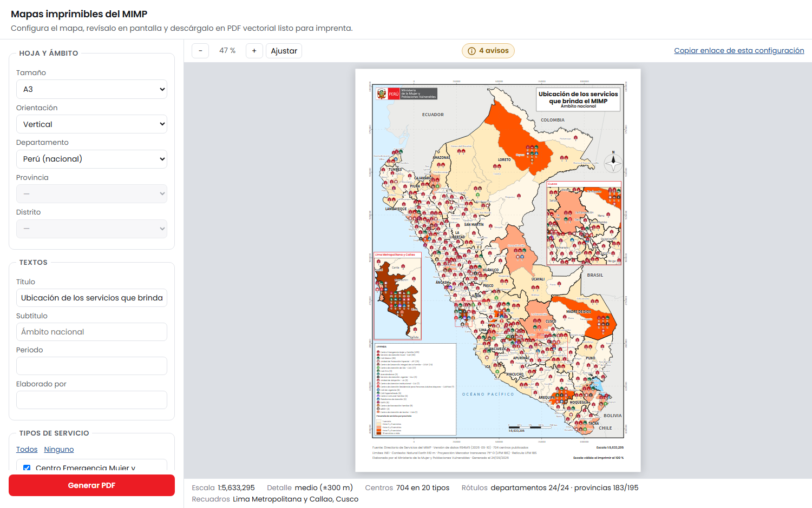
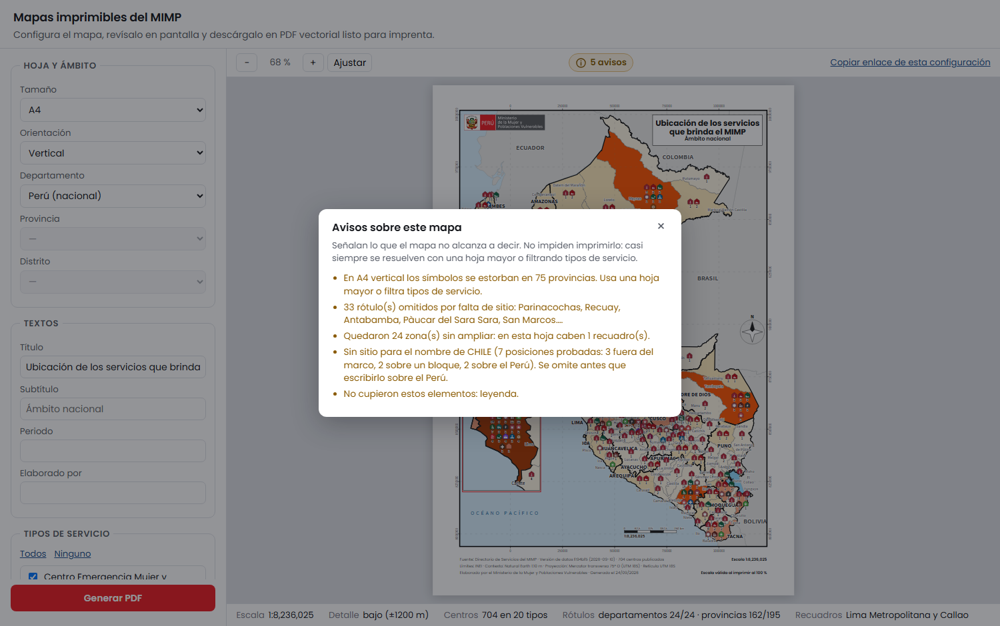
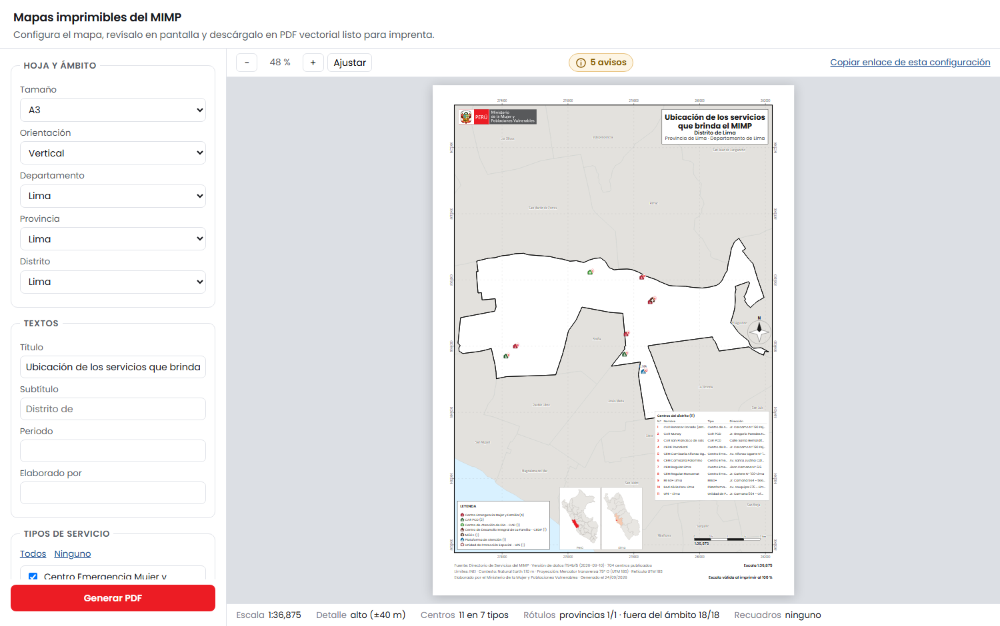

# Manual de uso

Para quien tiene que producir un mapa, no para quien toca el código. Del código habla
el [README](../README.md).

## Hacer un mapa

Abre **https://rodasluis.github.io/Mapas-de-servicios-de-MIMP/**. No hay que instalar
nada: el mapa se compone en el navegador y el PDF se descarga desde ahí.



A la izquierda se configura, a la derecha se revisa. El orden que ahorra tiempo:

1. **Hoja y ámbito.** El tamaño manda sobre todo lo demás: en A4 caben la mitad de los
   nombres que en A1, y un solo recuadro de zoom en vez de cuatro. Elige primero el
   papel en el que vas a imprimir.
2. **Ámbito.** Los tres selectores están encadenados: departamento, luego provincia,
   luego distrito. Déjalos en blanco para subir de nivel —sin provincia se imprime el
   departamento entero; sin departamento, el Perú—.
3. **Textos.** El subtítulo vacío significa *automático*: el campo muestra en gris el
   texto que se va a usar («Distrito de Breña»). Escribe sólo si quieres otro.
4. **Tipos de servicio.** Desmarcar tipos recalcula todo: los colores, la leyenda y los
   recuadros de zoom.
5. **Generar PDF.**

### Elegir a mano qué se amplía

Los recuadros de zoom vienen en **automático**: el mapa amplía donde los símbolos se
estorban. Con **Elegir zonas** se decide a mano, y las zonas se buscan bajando por la
jerarquía —departamento, provincia, distrito— y pulsando **Añadir zona**. Lo añadido
queda en una lista, cada entrada con su **Quitar**.

Lo que se puede ampliar depende del mapa, y por eso algún desplegable aparece apagado:

| Mapa de… | Se puede ampliar |
|---|---|
| Perú | un departamento entero o una de sus provincias |
| Un departamento | una provincia entera o uno de sus distritos |
| Una provincia | un distrito |
| Un distrito | nada: el recuadro repetiría el mapa a su lado |

Si el botón de añadir está apagado, falta bajar un nivel más: en un mapa provincial cada
recuadro es un distrito, así que hay que elegir uno.

### Los cuatro ámbitos responden preguntas distintas

| Ámbito | Qué responde | Cómo lo dibuja |
|---|---|---|
| Perú | Qué servicios llegan a cada provincia | Un ícono por tipo, con el número de sedes |
| Departamento | Cómo se reparten dentro del departamento | Lo mismo, por distrito |
| Provincia | Dónde está cada centro | Cada centro en su coordenada |
| Distrito | **Cuáles son**, con nombre y dirección | Cada centro numerado, más una tabla |

### La escala sólo vale si imprimes al 100 %

El pie de cada lámina lo dice. Si el diálogo de impresión trae «ajustar a la página»
—viene activado por omisión en casi todos—, la barra de escala deja de medir lo que
dice. Desactívalo.

## Los avisos dicen lo que el mapa **no** está diciendo



El botón de la barra se tiñe de ámbar cuando hay algo que señalar. Merece un vistazo
antes de imprimir: ahí es donde aparece que 113 nombres de provincia no cupieron, que
seis zonas pedían ampliación y sólo cabían dos, o que una tabla se quedó en 40 de 58
filas. Ninguna de esas cosas hace el mapa incorrecto, pero todas cambian lo que puedes
afirmar mirándolo.

Los dos que más suelen aparecer:

- **«Los símbolos se estorban en N provincias.»** Pasa cuando el papel es pequeño para
  la densidad de servicios. Se arregla con una hoja mayor o filtrando tipos.
- **«X no cabe ampliado en esta hoja… prueba con la hoja horizontal.»** No es un consejo
  genérico: el Perú es alto y estrecho, así que girar la hoja abre mucho más sitio que
  agrandarla. Cusco pasa de ×0,95 en A2 vertical a ×1,77 en A2 horizontal, con el mismo
  papel.

## Compartir una configuración

Toda la configuración vive en la barra de direcciones. **Copiar enlace de esta
configuración** da una URL que reproduce el mapa exacto: hoja, ámbito, textos, tipos,
capas y zonas ampliadas.

```
…/?ambito=1501&hoja=A2&tipos=CEM&sinCapas=grilla
```

Se puede corregir a mano. El ubigeo dice solo de qué nivel es por su longitud: dos
dígitos departamento, cuatro provincia, seis distrito.

Añadiendo `&fecha=2026-09-24` el PDF sale **idéntico byte a byte** cada vez que se abra
el enlace, con la misma línea «Generado el». Sirve para rehacer meses después un mapa
que se aprobó.



## Actualizar el directorio de servicios

Cuando el buscador publique una versión nueva:

1. Cambia `DATOS_TAG` en `package.json` por el nuevo commit o etiqueta.
2. `npm run datos` — lo descarga y **lo verifica**. Se detiene si el recuento no cuadra,
   si falta un ubigeo, si una coordenada cae fuera del Perú o si aparece un Hogar de
   Refugio Temporal, que nunca debe publicarse.
3. Lee el informe que imprime: total de centros, recuento por tipo y calidad de las
   coordenadas. Tiene que cuadrar con lo que anuncie el buscador para esa versión.
4. `npm run build`.
5. **Vuelve a aprobar las referencias visuales** (ver abajo): con datos nuevos el dibujo
   cambia, y esas diferencias son esperadas, no regresiones.

La versión queda registrada en `public/data/version.json` y aparece en el pie de cada
PDF, para que una lámina impresa siempre diga de qué corte de datos salió.

## Control de calidad

```bash
npm run muestras    # genera las 15 láminas de muestra y las comprueba
npm run qa          # regresión visual, vectorialidad y rendimiento
```

`npm run muestras` comprueba lo que se puede medir mientras compone: que los totales
por tipo y ámbito cuadran con `centros.json`, que ninguna caja se superpone a otra, que
la barra de escala mide lo que declara, que no hay ninguna imagen de mapa de bits, y que
el PDF descargado desde la web es idéntico al del banco.

`npm run qa` añade lo que sólo se ve mirando el archivo terminado: rasteriza cada PDF y
compara su dibujo con una referencia aprobada.

### Aprobar referencias nuevas

Cuando un cambio modifica el dibujo **a propósito**:

```bash
npm run qa -- --generar     # mira qué cambió; las diferencias van a muestras/regresion/
npm run qa -- --aprobar     # acepta el estado actual como referencia
```

Cuando una firma no cuadra, el control escribe la lámina en `muestras/regresion/` con
las celdas que cambiaron marcadas en rojo. Míralas antes de aprobar: **aprobar una
regresión la vuelve invisible**, y el siguiente que la encuentre será quien reciba el
mapa impreso.

Hay que volver a aprobar también al cambiar `DATOS_TAG` o la versión del navegador con
que se rasteriza. El archivo de referencias anota con qué `DATOS_TAG` se aprobó, y el
control avisa si no coincide.

## Qué hacer si algo sale mal

| Síntoma | Causa habitual |
|---|---|
| La página no compone y dice «ejecuta npm run preparar» | Faltan los datos derivados; no se versionan |
| El texto del PDF sale en otra tipografía | El navegador no cargó Poppins o Source Sans 3 |
| La barra de escala no mide lo que dice | Se imprimió con «ajustar a la página» |
| Faltan nombres de provincia | Cabe lo que cabe: hoja mayor, o filtra tipos |
| La tabla de un distrito está recortada | Lo dice ella misma al pie; usa una hoja mayor |
